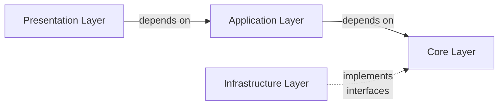

# ARCHITECTURE
This document explains about whole architecture of TRUST.


## System Architecture
See here[architecture.drawio](https://github.com/tmc-ccoe/trust-core/blob/dev/docs/architecture.drawio)


## Software Architecture

`trust-core` consists of four layers. Dependencies always point inward (toward the Core Layer).
Based on the Clean Architecture.



- **Presentation Layer**
  - Presentation I/F for other systems. like API or CLI.
- **Application Layer**
  - Depends on the Core Layer. Do not depend on Infrastructure Layer.
  - The Application Layer is responsible for implementing use cases. It defines specific application behaviors using the business rules from the Core Layer.
- **Core Layer**
  - Do NOT depend on any other layer.
  - The Core Layer is responsible for the heart of the business logic and defines the essential rules and behaviors of `TRUST`.
    This layer is completely independent of technical implementation details.
- **Infrastructure Layer**
  - Depends on the Core Layer (Implements interfaces defined in the Core Layer)
  - The Infrastructure Layer handles interactions with external libraries and external APIs. This layer implements concrete classes that fulfill the interfaces defined in the Core Layer.
  - Note: The Infrastructure Layer does not depend on the Application Layer.


## directory architecture
```
+-- rec-navi-core/  # repo root
+-- .github/
+-- docs/
+-- cli/  # CLI presentation
|
+-- src/  # source root
|   +-- recnavi/
|       +-- core/  # core layer
|       |   +-- agent_runner/
|       |   +-- agents/
|       |   +-- ...
|       |
|       +-- apis/  # API presentation layer
|       |   +-- auth/
|       |   +-- root/
|       |   +-- pub/
|       |   +-- cms/
|       |
|       +-- application/  # application layer
|       |   +-- analysis/
|       |   +-- chat/
|       |   +-- cms/
|       |   +-- dashboard/
|       |   +-- features/
|       |   +-- user/
|       |   +-- validation/
|       |
|       +-- infrastructure/  # infrastructure layer
|       |   +-- database/
|       |   +-- dataloader/
|       |   +-- external_clients/
|       |   +-- session_service/
|       |
|       +-- config/  # application config
|       +-- exceptions/
|       +-- task_runner/  # ECS Task runner
|       +-- main.py  # API server entry point
|
+-- tests
|   +-- data/  # for mock data
|   +-- mockups/
|   +-- unittests/  # Same directory architecture as `src`.
|   +-- integration/
|   +-- testing_util.py
|   +-- conftest.py
|
+-- .gitignore
+-- buildspec.yml
+-- Dockerfile
+-- pyproject.toml
+-- README.md
+-- uv.lock

```

## Test Architecture

Tests follow the same boundary rule as production code: each layer should be verified at the cheapest layer that still proves the behavior.

| Test layer | Directory | External dependency policy |
| ---------- | --------- | -------------------------- |
| Unit tests | `tests/unittests/` | No LocalStack, real AWS, Microsoft 365, Box, Azure, Google APIs, or repository secrets. Use `tests/mockups/`, lightweight fakes, `botocore.stub.Stubber`, or `moto`. |
| Integration tests | `tests/integration/` | Default command includes all integration tests. LocalStack-backed profiles use LocalStack, MySQL, OpenSearch, and local Cognito. |
| Real AWS tests | `tests/integration/` with markers | Use `pytest.mark.real_aws`; ECS dispatch tests also use `pytest.mark.ecs`. These tests are skipped automatically only when `AWS_ENDPOINT_URL` points to LocalStack. |

This keeps the everyday development workflow fast and deterministic while preserving a place for real-cloud validation when it is intentionally requested.
